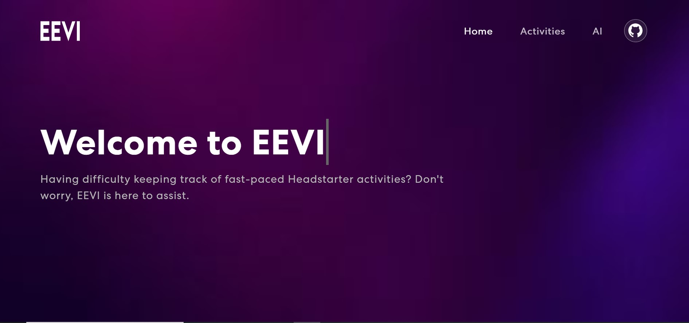

# EEVI - Centralized Activity Tracker Web App

Welcome to **EEVI**, a centralized activity tracker web application designed for the Fast Pacing Headstarter Fellowship. EEVI allows users to effortlessly discover and manage events and meetings, providing a streamlined experience for tracking and scheduling activities.

## Project Overview

EEVI was developed with a focus on simplicity and efficiency, catering to the needs of individuals who require an intuitive platform to keep track of their professional and personal engagements. The project integrates a modern tech stack and advanced AI features to ensure a robust, scalable, and intelligent solution.

## Tech Stack

- **Front-end**: React JS
- **Back-end**: Node JS, Express JS
- **Database**: PostgreSQL
- **Deployment**: Vercel (Client and Server), Azure (Database)
- **AI Integration**: Intelligent scheduling and recommendations

## Team and Responsibilities

- **Sunny Shaban Ali**: Front-end Development using React JS, Client and Server Deployment on Vercel, Google Analytics Setup, and AI and overall Project Integration
- **Abdul Rehman**: Back-end Development using Node JS and Express JS, Postgres Database Creation and Deployment on Azure, and Support with configuring AI Component
- **Burhanuddin**: Ideation, Figma Design, Support with Azure Deployment, and Demo Slides Preparation
- **Allison**: Ideation, Figma Design, and Demo Slides Preparation

## Walkthrough of the Website

For a detailed walkthrough of the EEVI web app, please watch the following video:

[YouTube Link](https://youtu.be/RyYKJZefvKc)

[View on Vercel](https://headstarter-hackathon-0-f.vercel.app/)

## Image Gallery

Below are some screenshots of EEVI showcasing various features of the application:

1. 
2. 
3. 
4. 

## Features

- **Event Discovery**: Easily find and explore upcoming events and meetings.
- **User-Friendly Interface**: Modern design and intuitive navigation for a seamless experience.
- **Real-Time Updates**: Keep track of new and scheduled events in real-time.
- **AI Integration**: Intelligent scheduling and recommendations. The app leverages AI to help users prepare schedules, suggest optimal times for meetings, and manage their agendas more efficiently.
